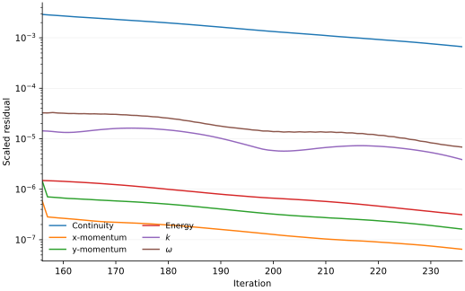
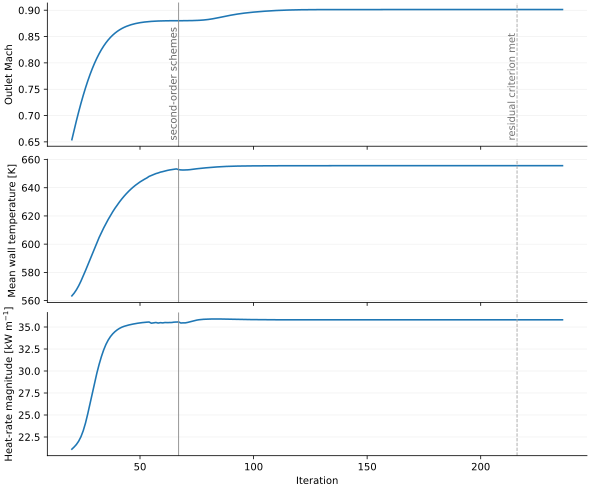

# NASA C3X Run 145 — reduced RANS/CHT benchmark

[](https://github.com/mehdichabane/NASA-C3X-Reduced-CHT-Fluent-Python/actions/workflows/checks.yml)

Ansys Fluent 26.1 + Python benchmark of **NASA C3X Run 145**, focused on
verification, comparison with public experimental data and reproducible
analysis. The primary model is steady two-dimensional compressible RANS/CHT
with SST `k-omega`.

> **Scope.** This is a reduced benchmark and does not claim a complete ASME
> V&V 20 validation. Internal coolant flow, film cooling and three-dimensional
> effects are not resolved.

## At a glance

| Item | Details |
|---|---|
| Experiment | NASA-CR-168015, Run 145 / code 4512 |
| Primary CFD model | Fluent 26.1, steady 2D compressible RANS/CHT, SST `k-omega` |
| Fine grid | `44,760` cells; maximum wall `y+ = 0.45189` |
| Experimental comparison | Pressure ratio, wall temperature and external HTC |
| Numerical checks | Final-window convergence, mass/interface/solid-energy balances, three-grid sensitivity |
| Sensitivity studies | Transition SST inlet conditions; internal-cooling `h` / `Tbulk`; internal-HTC `+/-3%` envelope |
| Reproducibility | Python rebuild in CI, released Fluent restart states and headless PyFluent saved-state checks |

## Fine-grid SST result

| Metric | Pressure side | Suction side |
|---|---:|---:|
| Wall-temperature MAE / MAPE | `8.887 K / 1.448%` | `12.999 K / 2.005%` |
| HTC MAPE | `7.795%` | `11.535%` |
| Pressure-ratio MAPE | `0.926%` | `3.980%` |

| Global check | Fine SST result |
|---|---:|
| Cells / final iteration | `44,760 / 236` |
| Mass-weighted outlet Mach | `0.901294` |
| Relative mass imbalance | `0.0000509%` |
| Fluid-solid interface mismatch | `0.00000558%` |
| Solid heat imbalance | `0.001921%` |
| Maximum wall `y+` | `0.45189` |

The outlet Mach is an **operating-point check**, not an independent validation
metric. NASA `M2 = 0.90` is pressure-derived, while the Fluent value is a
mass-flux-weighted average of local outlet Mach. The back-pressure adjustment is
documented in [`docs/outlet_pressure_selection.md`](docs/outlet_pressure_selection.md).

| Wall temperature | Heat-transfer coefficient |
|---|---|
|  |  |

| Fine mesh | Pressure ratio |
|---|---|
|  |  |

## Fluent outputs

| SST residuals, final window | SST engineering monitors |
|---|---|
|  |  |

The retained SST state is iteration `236`; the Transition SST state is iteration
`556`. Raw monitor, residual, wall and global-check exports are under
`data/fluent_exports/`, while the released case/data pairs are listed with their
SHA-256 hashes in [`fluent/restart_manifest.csv`](fluent/restart_manifest.csv).

## Numerical checks

- **Convergence and conservation.** The fine SST run keeps unchanged
  second-order settings over its final 20 iterations; engineering-monitor spans
  remain below `0.02%`, with the closure checks reported above.
- **Mesh sensitivity.** Coarse, medium and fine SST meshes contain `14,657`,
  `23,781` and `44,760` cells. Medium-to-fine changes in outlet Mach, mean wall
  temperature and external heat rate are below `0.1%`, while local
  trailing-edge profiles remain more sensitive. The three meshes are therefore
  reported as a sensitivity study rather than formal GCI.
- **Model sensitivity.** Transition SST gives pressure errors similar to SST but
  substantially larger thermal errors on the fine grid, so it is kept as a
  sensitivity case rather than the baseline.
- **Internal-cooling uncertainty sensitivity.** Applying NASA's reported
  `+/-3%` internal-HTC magnitude to the existing `h` sensitivity family gives
  about `+/-1.735 K` on mean external wall temperature; the SST wall-temperature
  bias remains positive on both surfaces across that envelope.

Details are in [`docs/convergence_acceptance.md`](docs/convergence_acceptance.md),
[`docs/meshing_recipe.md`](docs/meshing_recipe.md),
[`docs/nasa_comparison.md`](docs/nasa_comparison.md) and
[`studies/internal_cooling_sensitivity/NASA_UNCERTAINTY.md`](studies/internal_cooling_sensitivity/NASA_UNCERTAINTY.md).

## Model boundary

The calculation resolves the hot-gas passage, solid vane conduction and the
fluid-solid CHT interface. Ideal-gas density and the energy equation are
retained, with SST `k-omega` as the primary turbulence model.

The ten internal cooling passages are present geometrically, but coolant flow is
not solved. Each passage wall instead uses a passage-specific convection
condition based on `h` and `Tbulk`. The model also excludes coolant pressure loss
and temperature development, film cooling, endwall flow, radiation, structural
response and unsteady wake passing.

Full equations, boundary conditions, material values and source references are
in [`docs/model_setup.md`](docs/model_setup.md).

## Sensitivity studies

| Controlled perturbation | Main observed response |
|---|---|
| Internal cooling `h/h0: 1.00 -> 0.90` | `Tw_mean +6.104 K`; external heat rate `-5.393%`; outlet Mach `+0.000804%` |
| Internal `h +/-3%` envelope | `Tw_mean +/-1.735 K`; pressure-side bias `+6.827 ... +10.947 K`; suction-side bias `+11.416 ... +14.582 K` |
| Transition SST `mu_t/mu_in: 10 -> 1` at `Tu_in = 6.5%` | Near-LE `Tu 1.247% -> 0.364%`; transition-like suction response `x/Cx 0.653 -> 0.967`; external heat rate `-19.716%` |
| Transition SST `Tu_in: 6.5% -> 8.3%` at `mu_t/mu_in = 10` | Near-LE `Tu 1.247% -> 1.237%`; `Tw_mean -0.033%`; external heat rate `-0.122%` |

See [`studies/internal_cooling_sensitivity/README.md`](studies/internal_cooling_sensitivity/README.md)
and [`studies/transition_sst_sensitivity/README.md`](studies/transition_sst_sensitivity/README.md).

## Reproduce the analysis

Tested in CI with Python 3.13:

```bash
python -m venv .venv
source .venv/bin/activate          # Windows: .venv\Scripts\activate
python -m pip install -r requirements.txt -r requirements-preprocess.txt
python scripts/preprocess/build_internal_convection_inputs.py --check
python scripts/run_all.py
python -m pytest -q
```

`run_all.py` rebuilds the processed tables, checks and figures from committed
Fluent exports; it **does not launch Fluent**.

The [Fluent restart release](https://github.com/mehdichabane/NASA-C3X-Reduced-CHT-Fluent-Python/releases/tag/initial-public-release)
contains the Fluent 26.1 case/data pairs. SHA-256 values are in
[`fluent/restart_manifest.csv`](fluent/restart_manifest.csv). Headless PyFluent
checks reopen the fine SST and Transition SST states and recompute stored scalar
reports. Full solver reruns are outside the CI workflow; see
[`docs/reproducibility.md`](docs/reproducibility.md).

## Documentation

- [Modeling notes](MODELING_NOTES.md)
- [Project development notes](docs/project_history.md)
- [Model setup](docs/model_setup.md)
- [Outlet-pressure selection](docs/outlet_pressure_selection.md)
- [Convergence and balances](docs/convergence_acceptance.md)
- [Mesh study](docs/meshing_recipe.md)
- [NASA comparison](docs/nasa_comparison.md)
- [Reproducibility](docs/reproducibility.md)

## Source and licence

Primary experimental source: [Hylton et al., *Analytical and Experimental
Evaluation of the Heat Transfer Distribution over the Surfaces of Turbine
Vanes*, NASA-CR-168015, 1983](https://ntrs.nasa.gov/citations/19830020105).

Code is released under the MIT License. Citation metadata are in
[`CITATION.cff`](CITATION.cff). NASA data and Ansys-generated material remain
subject to their original terms; see [`THIRD_PARTY_NOTICES.md`](THIRD_PARTY_NOTICES.md).
