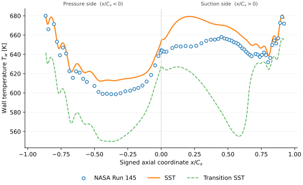
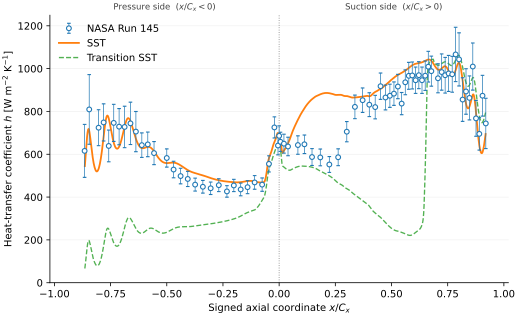
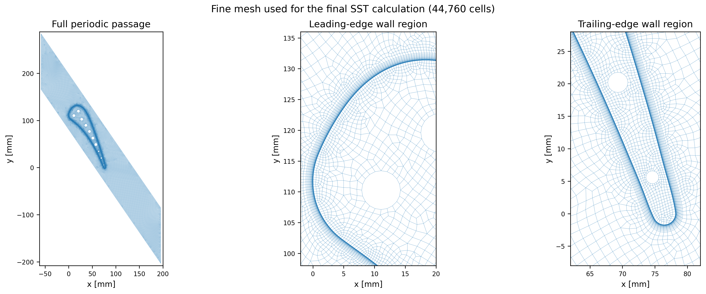
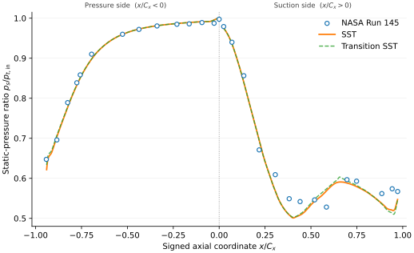

# NASA C3X Run 145: reduced RANS/CHT benchmark

[](https://github.com/mehdichabane/NASA-C3X-Reduced-CHT-Fluent-Python/actions/workflows/checks.yml)

Reduced benchmark of NASA C3X Run 145 using steady two-dimensional compressible
RANS and conjugate heat transfer in Ansys Fluent 26.1, with Python-based
verification, experimental comparison, sensitivity analysis and regression-tested
post-processing.

## At a glance

- **Problem.** Compare a reduced midspan C3X vane model against public NASA Run
  145 pressure, wall-temperature and heat-transfer measurements while keeping
  the limits of the reduced physics explicit.
- **Built.** The hot-gas passage and solid vane are resolved. The ten internal
  passages use NASA-derived, passage-specific convection boundary conditions.
  SST `k-omega` is the primary model; Transition SST and internal-cooling inputs
  are examined through separate sensitivity studies. A Python workflow rebuilds
  the processed results and figures and checks convergence, conservation, mesh
  sensitivity and cross-case consistency.
- **Strongest evidence.** The fine-grid SST case gives wall-temperature MAE of
  `8.887 K` pressure / `12.999 K` suction, HTC MAPE of `7.795% / 11.535%` and
  pressure-ratio MAPE of `0.926% / 3.980%`. Mass, interface and solid-energy
  balances close within `0.0019%`, maximum wall `y+` is `0.452`, and the three
  reported global quantities change by less than `0.1%` from medium to fine
  mesh.
- **Main limitation.** Coolant flow, film cooling and three-dimensional effects
  are not resolved. The retained mesh-generation record does not support a formal
  discretization-uncertainty estimate, model-input uncertainty is not propagated
  into a combined ASME V&V 20 validation uncertainty, and no complete
  initialization-to-final Fluent replay is claimed.

**Engineering scope:** compressible CFD, conjugate heat transfer, three-grid
mesh sensitivity, numerical verification, experimental comparison,
model-sensitivity analysis, Python automation and regression testing.

## Fine-grid SST results

| Quantity | Result |
|---|---:|
| Final iteration | `236` |
| Mass-weighted outlet Mach (operating-point check) | `0.901` |
| Wall-temperature MAE / MAPE | `8.887 K / 1.448%` pressure; `12.999 K / 2.005%` suction |
| HTC MAPE | `7.795%` pressure / `11.535%` suction |
| Pressure-ratio MAPE | `0.926%` pressure / `3.980%` suction |
| Relative mass imbalance | `5.1e-5%` |
| Fluid-solid interface mismatch | `5.6e-6%` |
| Solid heat imbalance | `0.0019%` |
| Maximum wall `y+` | `0.452` |

The `236200 Pa` pressure outlet was selected until the Fluent mass-weighted
outlet Mach was numerically consistent with the nominal NASA Run 145
`M2 = 0.90` operating point. NASA `M2` is pressure-derived from measured inlet
total pressure and average measured exit-plane static pressure, whereas the
saved Fluent `fine_mach_outlet` report is a `surface-massavg` of local Mach on
the outlet. Their numerical proximity is therefore an operating-point
consistency check, not a like-for-like Mach validation error or an independent
validation metric; the selection record is in
[`docs/outlet_pressure_selection.md`](docs/outlet_pressure_selection.md).

Wall-temperature MAPE is retained as a compact relative summary, but the
headline result also reports MAE in kelvin because it is the more directly
interpretable dimensional error for an absolute-temperature comparison.

| Wall temperature | Heat-transfer coefficient |
|---|---|
|  |  |

HTC error bars in the comparison figure represent the reported experimental HTC
uncertainty only; they are not a combined validation-uncertainty band.

| Fine mesh | Pressure ratio |
|---|---|
|  |  |

**Scope of the evidence.** The archived baseline satisfies the stated
convergence and conservation checks, the three reported global quantities change
by less than `0.1%` from medium to fine mesh, and the sampled NASA stations are
compared quantitatively. These results do not establish a formal
discretization-uncertainty estimate, a combined ASME V&V 20 validation
uncertainty, resolved internal-coolant or three-dimensional physics, or an
initialization-to-final solver replay.

## Reduced model

Included:

- steady 2D compressible external flow;
- ideal-gas density and the energy equation;
- translationally periodic cascade passage;
- gas-solid conjugate heat transfer;
- SST `k-omega` as the primary turbulence model;
- fine-grid Transition SST baseline and inlet-turbulence sensitivity study;
- deterministic sensitivity studies of the prescribed internal cooling inputs;
- second-order final discretization.

Excluded:

- resolved coolant flow and coolant pressure loss;
- film cooling;
- three-dimensional endwall effects;
- radiation, structural response and wake passing.

The model definition, equations, boundary conditions, material values and links
to their implementations are in [`docs/model_setup.md`](docs/model_setup.md).

## Three-grid and balance checks

| Mesh | Cells | External wall faces | Final SST iteration |
|---|---:|---:|---:|
| Coarse | `14,657` | `311` | `156` |
| Medium | `23,781` | `473` | `161` |
| Fine | `44,760` | `819` | `236` |

Medium-to-fine changes are `0.0972%` for mass-weighted outlet Mach, `0.0332%`
for mean external wall temperature and `0.0837%` for external heat-transfer
rate. These sub-`0.1%` values apply to those three global quantities only: local
profiles remain more mesh-sensitive near the trailing edge, where the
pressure-side pressure-ratio diagnostic reaches an `8.76%` range-normalized
medium-to-fine MAE over the final `5%` of surface distance. This is a
profile-shape diagnostic, not a pointwise `8.76%` pressure error. The results are
a three-grid sensitivity assessment, not a formal asymptotic GCI; details are in
[`docs/meshing_recipe.md`](docs/meshing_recipe.md).

The fine SST calculation continued for 20 iterations after the active
continuity criterion was first met. The final-window monitor spans and the mass,
interface and solid-energy balances are listed in
[`docs/convergence_acceptance.md`](docs/convergence_acceptance.md). Mesh quality,
realized-mesh diagnostics and missing GUI generation settings are recorded in
[`docs/meshing_recipe.md`](docs/meshing_recipe.md).

## Comparison with Run 145 measurements

Appendix A, page 180 of NASA-CR-168015 supplies the pressure, wall-temperature
and HTC stations used here. CFD profiles are matched by axial coordinate on the
pressure and suction sides. `scripts/comparison/compare_run145.py` calculates
bias, MAE, RMSE, maximum absolute error and MAPE.

NASA's experimental uncertainty record is also retained. Table VI supplies the
regional external-HTC uncertainty used for the plotted error bars, while the
Data Uncertainties subsection and Table VII provide measurement, geometry,
experimental-reduction and test-parameter uncertainties. Those additional
values are transcribed in
[`references/experimental_data/c3x_experimental_uncertainty_summary.csv`](references/experimental_data/c3x_experimental_uncertainty_summary.csv)
and interpreted in [`docs/nasa_comparison.md`](docs/nasa_comparison.md).

Transition SST gives similar pressure errors but much larger thermal errors. It
is kept as a sensitivity case rather than used as the primary thermal result.
The mapping, point counts, metrics and interpretation limits are in
[`docs/nasa_comparison.md`](docs/nasa_comparison.md).

The repository reports a benchmark comparison, iterative/conservation
verification checks and a three-grid mesh-sensitivity assessment. It does not
claim conformance to a complete [ASME V&V 20](https://www.asme.org/codes-standards/find-codes-standards/standard-for-verification-and-validation-in-computational-fluid-dynamics-and-heat-transfer/2009)
validation assessment. NASA experimental uncertainties are documented, but the
retained mesh-generation record does not support an accepted formal
discretization-uncertainty estimate and model-input uncertainty is not
propagated. The repository therefore does not construct a combined
validation-uncertainty budget.

## What the sensitivity studies show

Two completed studies test assumptions that materially affect the thermal
solution. They are deterministic sensitivity studies, not calibration exercises
and not uncertainty quantification.

| Controlled perturbation | Observed response |
|---|---|
| Internal cooling `h/h0: 1.00 -> 0.90` | `Tw_mean +6.104 K`; external heat rate `-5.393%`; outlet Mach `+0.000804%` |
| Transition SST `mu_t/mu_in: 10 -> 1` at `Tu_in = 6.5%` | `Tu` at 2-5 mm before LE `1.247% -> 0.364%`; transition-like suction response `x/Cx 0.653 -> 0.967`; external heat rate `-19.716%` |
| Transition SST `Tu_in: 6.5% -> 8.3%` at `mu_t/mu_in = 10` | near-LE `Tu 1.247% -> 1.237%`; `Tw_mean -0.033%`; external heat rate `-0.122%` |

**Internal cooling boundary conditions.** All ten prescribed internal HTC values
and coolant bulk temperatures were perturbed around the accepted fine-grid SST
baseline. The thermal response is strong and nearly linear over the screened
ranges, while pressure ratio and outlet Mach remain effectively unchanged. A
local four-corner `(+/-5% h, +/-5 K)` factorial check finds only a small bilinear
interaction relative to the two main effects. See
[`studies/internal_cooling_sensitivity/README.md`](studies/internal_cooling_sensitivity/README.md).

**Transition SST inlet turbulence.** At fixed `Tu_in = 6.5%`, reducing the inlet
turbulent-viscosity ratio from `10` to `5` and `1` strongly changes the
freestream turbulence decay reaching the vane and moves the suction-side
transition-like response downstream, with large thermal changes but much smaller
changes in outlet Mach. At fixed viscosity ratio `10`, changing the documented
inlet turbulence level from `6.5%` to `8.3%` produces only a small near-vane and
thermal response because the imposed difference is strongly attenuated before
the leading edge. These diagnostics explain model sensitivity; they do not
identify an experimentally verified transition location or an optimal inlet
setting. See
[`studies/transition_sst_sensitivity/README.md`](studies/transition_sst_sensitivity/README.md).

The committed study matrices and summary tables are also checked by
`scripts/verification/check_sensitivity_studies.py`; this protects the reported
cross-case relationships in CI but does not replay the Fluent sensitivity runs.

## Assumption and uncertainty status

| Source of modeling or numerical uncertainty | Treatment in this repository |
|---|---|
| Spatial discretization | Three-grid solution sensitivity; no formal asymptotic GCI or discretization-uncertainty band |
| Internal cooling `h` and `Tbulk` | Common-mode deterministic one-factor screening plus a local `h x Tbulk` interaction check; passage-to-passage uncertainty is not quantified and this is not probabilistic UQ |
| Transition SST inlet state | Fine-grid sensitivity to `Tu_in` and turbulent-viscosity ratio; turbulence length scale is not varied independently |
| Hot-gas `Cp`, molecular viscosity and thermal conductivity | Constant values defined by the released Fluent baseline; property-choice sensitivity is not evaluated; independent literature matches are recorded with explicit exact/derived scope in `references/model_inputs/` |
| Experimental uncertainty | NASA Table VI regional HTC intervals plus component/test-parameter uncertainties are transcribed; only Table VI is used in the plotted HTC interval check, and none is combined with CFD uncertainty into a validation budget |
| Solver-state reproducibility | Saved case/data pairs are released; an optional pinned-PyFluent helper explicitly launches Fluent 26.1 in 2D double precision and recomputes existing scalar reports, but no full initialization-to-final replay is claimed |
| Model-input uncertainty | Not propagated into a combined validation uncertainty budget |

This table separates quantities that were actually screened from assumptions
that remain unquantified. The latter should not be read as negligible merely
because the baseline comparison is good.

## Run from a fresh clone

Tested with Python 3.13.

```bash
python -m venv .venv
source .venv/bin/activate          # Windows: .venv\Scripts\activate
python -m pip install -r requirements.txt
python scripts/run_all.py
python -m pytest -q
```

`run_all.py` executes 14 project-specific processing, verification and plotting
stages. It reads the committed Fluent exports and does not launch Fluent.

To rebuild the ten internal-convection inputs, install CoolProp and run the
separate check:

```bash
python -m pip install -r requirements-preprocess.txt
python scripts/preprocess/build_internal_convection_inputs.py --check
```

## Saved Fluent states

The matching [Fluent restart release](https://github.com/mehdichabane/NASA-C3X-Reduced-CHT-Fluent-Python/releases/tag/initial-public-release)
contains Fluent 26.1 case/data pairs for coarse, medium and fine SST, plus the
fine Transition SST case. Filenames, iterations, cell counts and SHA-256 values
are in [`fluent/restart_manifest.csv`](fluent/restart_manifest.csv). Reopening
steps are in [`fluent/README.md`](fluent/README.md).

For a local licensed Fluent 26.1 installation, the optional
`scripts/verification/replay_saved_state_reports.py` helper uses the PyFluent
version pinned in `requirements-fluent.txt` to launch a 2D double-precision
session, open a released case/data pair and recompute existing scalar report
definitions. It is not part of CI and is not a replay from initialization. The
launch configuration is unit-tested in CI; no JSON from an actual licensed
Fluent 26.1 execution is committed, so a live saved-state audit is not claimed.

The saved states can be reopened and the realized Fluent meshes can be audited
directly. The original SpaceClaim and Ansys Meshing construction history was not
retained. No complete replay from initialization, with a transcript and
final-state equivalence checks, is included. The exact status is summarized in
[`docs/reproducibility.md`](docs/reproducibility.md).

## Technical notes

- [Model definition and implementation](docs/model_setup.md)
- [Run 145 outlet-pressure selection](docs/outlet_pressure_selection.md)
- [Fine-grid convergence and balances](docs/convergence_acceptance.md)
- [Three-grid mesh record](docs/meshing_recipe.md)
- [NASA coordinate matching and error metrics](docs/nasa_comparison.md)
- [Internal cooling boundary-condition sensitivity](studies/internal_cooling_sensitivity/README.md)
- [Transition SST inlet-turbulence sensitivity](studies/transition_sst_sensitivity/README.md)
- [Reproducibility status](docs/reproducibility.md)
- [Experimental data transcription](references/experimental_data/README.md)

## Known limits

- The model is steady and two-dimensional.
- Internal cooling is represented by prescribed convection boundaries.
- The original interactive meshing construction history was not saved, although the realized Fluent meshes are retained.
- Hot-gas `Cp`, molecular viscosity and thermal conductivity are constant baseline inputs whose sensitivity is not evaluated.
- Input-property uncertainty is not propagated into the comparison metrics.
- No coarse or medium Transition SST calculation is included.
- The internal-cooling screening perturbs all ten passages coherently; passage-specific uncertainty in `h`, `Tbulk` or `C_r` is not quantified.
- The sensitivity perturbations are deterministic screening values, not measured
  confidence intervals or a combined uncertainty budget.

## Source and licence

Primary experimental source: [Hylton et al., *Analytical and Experimental
Evaluation of the Heat Transfer Distribution over the Surfaces of Turbine
Vanes*, NASA-CR-168015, 1983](https://ntrs.nasa.gov/citations/19830020105).

Code is released under the MIT License. NASA data and Ansys-generated material
remain subject to their original terms; see
[`THIRD_PARTY_NOTICES.md`](THIRD_PARTY_NOTICES.md).
