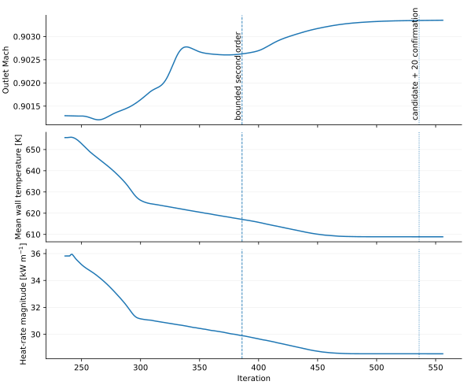
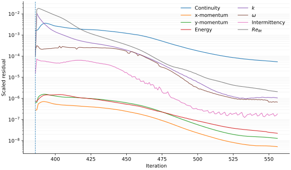

# Fine-grid convergence and balances

A final state is retained when the settings remain unchanged for 20 iterations,
the continuity residual is below `1e-3`, each engineering-monitor relative span
is below `0.02%`, and the mass and heat balances meet the limits below.

Continuity is the only equation residual used as an explicit scalar acceptance
gate because it is the slowest-decaying residual in the retained SST final
window. At iteration 217, the other monitored equation residuals were already
at or below `1.27e-5`, while continuity was `9.76e-4`; at iteration 236 they
were all below `6.84e-6` while continuity was `6.66e-4`. The complete residual
histories are still inspected and plotted. The acceptance rule therefore does
not treat `continuity < 1e-3` as sufficient by itself: the engineering monitors
and conservation checks below must also pass. This is a project-specific
acceptance rule, not a universal Fluent convergence threshold.

## SST final window: iterations 217-236

The active continuity criterion was first met at iteration 216. The calculation
continued for 20 iterations with the same second-order settings.

| Check | Result | Limit |
|---|---:|---:|
| Continuity residual | `6.6568e-04` | `1e-3` |
| Outlet-Mach span | `0.004506%` | `0.02%` |
| Mean-wall-temperature span | `0.000124%` | `0.02%` |
| Heat-rate span | `0.001741%` | `0.02%` |
| Relative mass imbalance | `0.0000509%` | `0.01%` |
| Fluid-solid interface mismatch | `0.00000558%` | `0.01%` |
| Solid heat imbalance | `0.001921%` | `0.05%` |
| Maximum wall `y+` | `0.45189` | `1.0` |

The solid receives `35,819.602 W/m` through the external interface and rejects
`35,818.914 W/m` through the internal convection boundaries, leaving
`0.688 W/m`.

| Final residual window | Engineering monitors |
|---|---|
|  |  |

## Transition SST final window: iterations 537-556

The case starts from the fine SST field. The transition equations changed to
bounded second order at iteration 386.

| Check | Result | Limit |
|---|---:|---:|
| Continuity residual | `5.4279e-05` | `1e-3` |
| Outlet-Mach span | `0.000539%` | `0.02%` |
| Mean-wall-temperature span | `0.000065%` | `0.02%` |
| Heat-rate span | `0.000354%` | `0.02%` |
| Relative mass imbalance | `0.0001503%` | `0.01%` |
| Fluid-solid interface mismatch | `0.0000191%` | `0.01%` |
| Solid heat imbalance | `0.0001889%` | `0.05%` |
| Maximum wall `y+` | `0.398393` | `1.0` |

| Engineering monitors | Final second-order residuals |
|---|---|
|  |  |

The source monitor, residual and balance exports are under
`data/fluent_exports/` and `data/fluent_exports/transition_sst/`.
