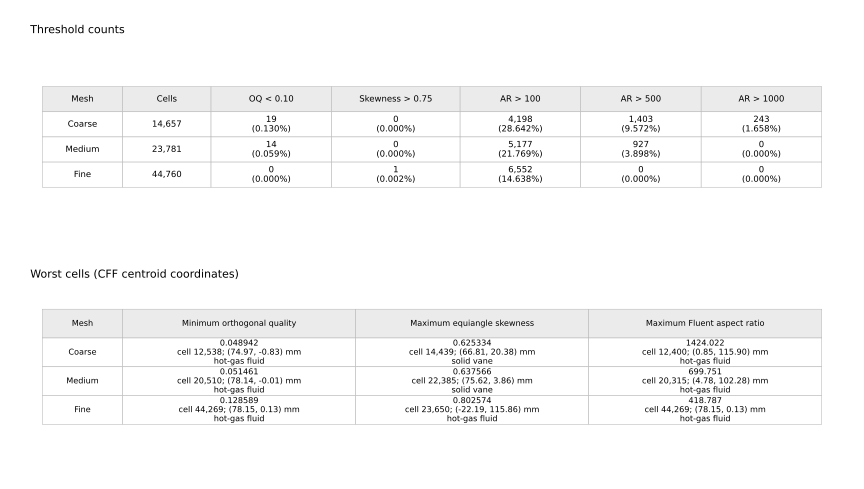

# Three-grid mesh record

## Retained geometry and meshes

The repository contains:

- NASA C3X profile coordinates;
- ten internal-passage centre and diameter definitions;
- a translational pitch of `0.117730 m`;
- SpaceClaim point-curve imports;
- the accepted Fluent CFF meshes in the separate restart bundle.

The passage boundary can be regenerated with:

```bash
python scripts/geometry/build_periodic_passage.py
```

| Mesh | Nodes | Cells | External wall faces | Final SST iteration |
|---|---:|---:|---:|---:|
| Coarse | `15,186` | `14,657` | `311` | `156` |
| Medium | `24,548` | `23,781` | `473` | `161` |
| Fine | `45,999` | `44,760` | `819` | `236` |

The fine mesh uses a `1 micrometre` first layer and `30` inflation layers. Its
external-wall `y+` minimum, area-weighted mean and maximum are
`0.01044 / 0.30441 / 0.45189`.

## Quality data

`scripts/verification/extract_restart_mesh_quality.py` reads the CFF cases and
calculates equiangle skewness, orthogonal quality and Fluent aspect ratio.

| Mesh | OQ `< 0.10` | Skewness `> 0.75` | AR `> 100` | AR `> 500` | AR `> 1000` |
|---|---:|---:|---:|---:|---:|
| Coarse | `19 (0.130%)` | `0` | `4,198 (28.642%)` | `1,403 (9.572%)` | `243 (1.658%)` |
| Medium | `14 (0.059%)` | `0` | `5,177 (21.769%)` | `927 (3.898%)` | `0` |
| Fine | `0` | `1 (0.002%)` | `6,552 (14.638%)` | `0` | `0` |

The high aspect ratios occur mainly in anisotropic hot-gas cells. Mesh quality
is considered together with positive volumes, periodicity, wall resolution,
convergence, conservation and three-grid solution sensitivity.



The machine-readable table is
`data/fluent_exports/mesh_sensitivity/mesh_quality_distribution_all_grids.csv`.

## Global and trailing-edge sensitivity

Medium-to-fine changes in outlet Mach number, mean wall temperature and
external heat rate are below `0.1%`. Local profiles remain more sensitive in
the last `5%` of surface distance near the trailing edge.

For the local comparison, both meshes are interpolated onto the same `s/L`
coordinate. The reported range-normalized MAE is

`100 x MAE / (max(phi_fine) - min(phi_fine))`

evaluated over the same surface and region. It is a profile-shape diagnostic,
not a pointwise relative error and not a percentage error in the physical
quantity itself. All trailing-edge ranges listed below are non-zero, so the
zero-range fallback implemented in the post-processing is not used here.

| Surface | Quantity | Medium-to-fine MAE | MAE / local fine-grid range |
|---|---|---:|---:|
| Pressure | `p_s/p_t,in` | `0.00764` | `8.76%` |
| Pressure | Wall temperature | `0.927 K` | `4.84%` |
| Pressure | Heat flux | `4.199 kW/m2` | `4.06%` |
| Pressure | HTC | `42.99 W/(m2 K)` | `3.87%` |
| Suction | `p_s/p_t,in` | `0.00258` | `4.56%` |
| Suction | Wall temperature | `0.943 K` | `3.77%` |
| Suction | Heat flux | `1.053 kW/m2` | `1.65%` |
| Suction | HTC | `13.06 W/(m2 K)` | `2.74%` |

For example, the pressure-side `8.76%` value means that the medium-to-fine
pressure-ratio MAE is `0.00764`, which is `8.76%` of the fine-grid
pressure-ratio range within the last `5%` of that surface. It does **not** mean
that the medium-grid pressure is locally `8.76%` different from the fine-grid
pressure.

The full local summary is
`results/processed/mesh_sensitivity/run145_three_grid_local_profile_summary.csv`.
The global results therefore do not imply uniform local grid insensitivity.

The post-processing also computes Richardson/GCI screening diagnostics for the
three global quantities using an effective two-dimensional spacing proportional
to `1/sqrt(N_cells)`. The machine-readable output therefore contains observed
order, Richardson-extrapolated value, fine/medium GCI and asymptotic-ratio
fields. These values are retained as exploratory diagnostics only; they are not
accepted or reported here as formal discretization uncertainties. The retained
meshing record cannot establish that the three meshes form a systematically
similar refinement family with the same generation parameters and controlled
reference-spacing ratios. The missing sizing, bias and meshing-method records
listed below are precisely why the project reports a three-grid sensitivity
rather than a formal asymptotic GCI assessment.

## Transition SST mesh qualification

The original Workbench/Ansys Meshing construction history was not retained, but
the **realized mesh solved by Fluent is preserved in the CFF case files**. A CFF
case stores node coordinates plus face/cell/node connectivity, so several
Transition-SST-specific resolution quantities can be audited directly from the
saved mesh rather than inferred from the missing GUI recipe.

Direct inspection of the released fine CFF mesh gives:

- `819` external vane wall faces in total;
- `373` pressure-side and `446` suction-side wall faces/cells when the retained
  wall-face centres are mapped to the repository C3X pressure/suction profile;
- a first wall-normal layer thickness of approximately `1.0 micrometre`;
- `30` successive inflation layers whose realized wall-normal thicknesses follow
  an approximately `1.20` geometric expansion (`1.000, 1.200, 1.440, 1.728, ...`
  micrometres before the post-inflation jump);
- byte-identical CFF mesh datasets between the released fine SST iteration-236
  state and the released Transition SST iteration-556 state.

The accepted Transition SST direct wall export gives
`y+` min / area mean / max of `0.007890 / 0.251092 / 0.398393`.

The [Fluent 2026 R1 Transition SST mesh requirements](https://ansyshelp.ansys.com/public/Views/Secured/corp/v261/en/flu_th/flu_th_sec_turb_sst_grid.html)
recommend, as best practice, maximum `y+` of about `1`, a wall-normal expansion
ratio below `1.1`, and approximately `100-150` streamwise cells on each side of
a turbine blade. The realized mesh therefore **comfortably satisfies the
wall-resolution and streamwise-count recommendations but does not satisfy the
recommended wall-normal expansion ratio**: the retained inflation stack is
approximately `1.20`, not `<1.1`. Fluent's own flat-plate study reports a small
but noticeable upstream transition shift at expansion factor `1.2` and warns
that wall-normal sensitivity can increase in pressure-gradient flows.

No coarse or medium Transition SST solutions were run, so the extracted
transition-like response locations remain fine-grid diagnostics. The saved mesh
can still be audited directly: it satisfies the wall-resolution and
streamwise-count recommendations, while its `~1.20` wall-normal expansion
remains a limitation for Transition SST.

## Missing setup information

The following **mesh-generation inputs/history** were not retained as an
editable Workbench/Ansys Meshing recipe:

- the original inflation-control object and entered growth-rate setting;
- global and local element-size controls;
- edge-division and bias-control objects;
- curvature and proximity controls;
- meshing-method and smoothing-control settings;
- operation order in SpaceClaim and Ansys Meshing;
- the original Workbench project history.

This does not erase the realized mesh information stored in the Fluent CFF case:
for example, the actual first-layer height, inflation-layer progression,
streamwise wall-face counts and connectivity can be recovered directly. What
cannot be done from the retained source curves alone is to recreate the original
interactive meshing procedure bit-for-bit and prove that it would regenerate the
same CFF mesh.
